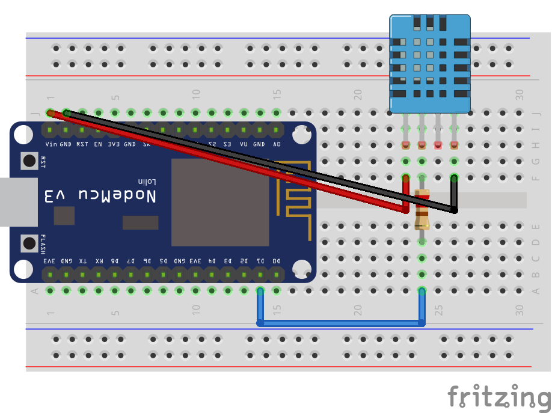

# esp8266-dht11
Contoh penggunaan sensor DHT 11 pada esp8266 

## Kebutuhan perangkat
Adapun untuk melakukan percobaan ini dibutuhkan beberapa perangkat seperti
+ ESP8266 Amica, boleh lolita
+ Sensor DHT11
+ Kabel jumper sebanyak 3 buah, male female
+ Resistor, ketika DHT11 tidak memiliki pcb, biasanya terdiri dari 3 pin
+ Breadboard
+ Library dapat diunduh di [https://github.com/adafruit/DHT-sensor-library.git](https://github.com/adafruit/DHT-sensor-library.git) dan [https://github.com/adafruit/Adafruit_Sensor.git](https://github.com/adafruit/Adafruit_Sensor.git)

## Skematik
Untuk design skematik dapat digambarkan di bawah ini

Design dalam format fritzing dapat diambil di [esp8266-dht11.fzz](esp8266-dht11.fzz)

## Koneksi eps8266 dan DHT11
Dari gambar di atas dapat dilihat pengkabelan seperti pada tabel di bawah ini

| ESP8266 Amica | DHT11                  |
|---------------|------------------------------------|
| Vin           | VCC                                |
| GND           | GND                                |
| D1            | Data                               |